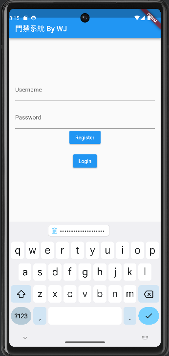
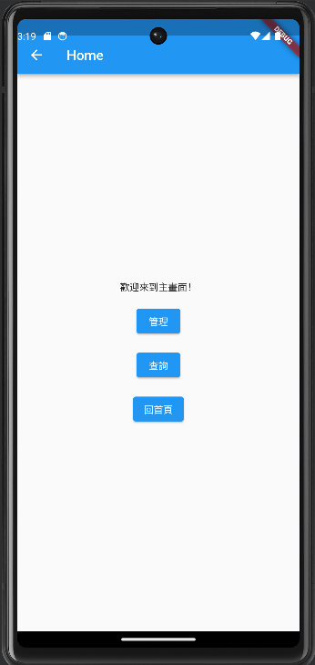
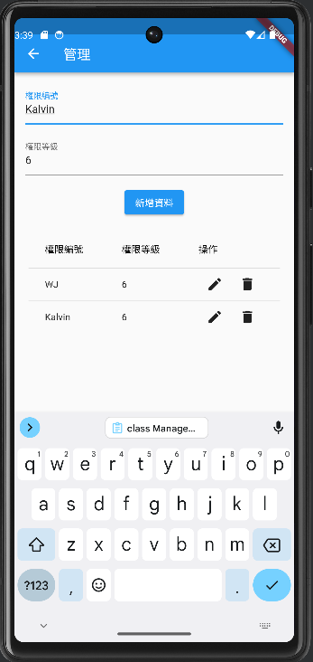
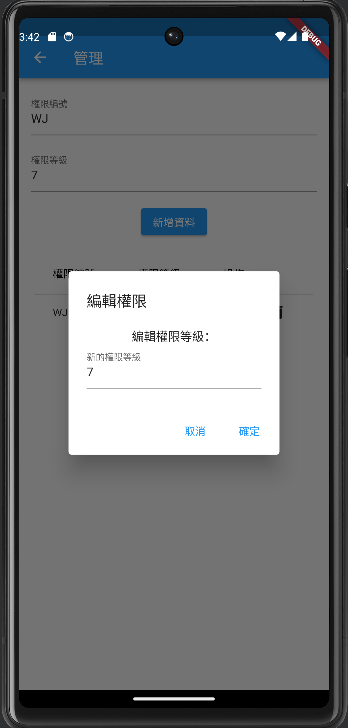
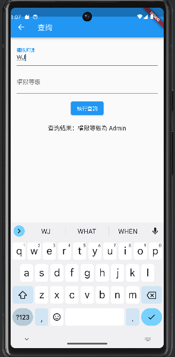
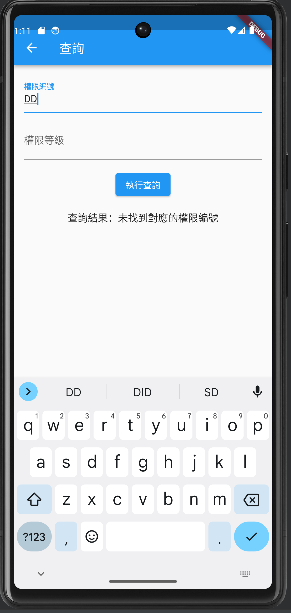

# 分鏡板(Story Board)

- 登入介面包含:
  - Usernme:輸入帳號。
  - Password:輸入密碼。
  - Login:辨識帳號密碼，若正確讓使用者進行登入；錯誤則在介面顯示錯誤訊息。
  - Register:讓使用者註冊帳號。

- 登入後進入主畫面，主畫面功能有:
  - 管理:可以進入管理頁面，進行新增、更改及刪除資料的動作
  - 查詢:可以讓使用者查詢權限

- 管理頁面可以輸入新卡片的編號及權限，並新增到資料庫裡。

- 可以點選資料旁的兩個icon對資料做編輯及刪除。

- 使用查詢尋找對應查詢編號的權限
