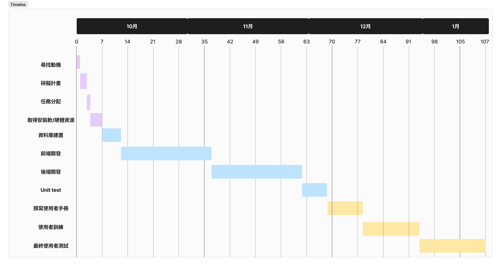

# Assigning the work
| 任務 | 說明            | 需時(天) | 前置任務 |          人員          | 成員   |
|:----:|:--------------- |:--------:|:--------:|:----------------------:| ------ |
|  1   | 尋找動機        |    1     |    -     |          All           | 姚佳凱 |
|  2   | 研擬計畫        |    2     |    1     |          All           | 林偉傑 |
|  3   | 任務分配        |    1     |    2     |          All           | 王俊傑 |
|  4   | 取得安裝軟/硬體資源 |    3     |    3     |          All           | 陳宗麟 |
|  5   | 資料庫建置      |    5     |    4     |     姚佳凱、林暐捷     | 黃威揚 |
|  6   | 前端開發        |    25    |    5     | 姚佳凱、林暐捷、王俊傑 | -      |
|  7   | 後端開發        |    25    |    5     |     姚佳凱、林暐捷     | -      |
|  8   | Unit test       |    10    |   6,7    | 姚佳凱、林暐捷、王俊傑 | -      |
|  9   | 撰寫使用者手冊  |    10    |    4     |     陳宗麟、黃威揚     | -      |
|  10  | 使用者訓練      |    15    |   6,7    |          All           | -      |
|  11  | 最終使用者測試  |    10    |  8,9,10  |          All           | -      |

# Gantt Diagram

# PERT Diagram

# Critical Path
