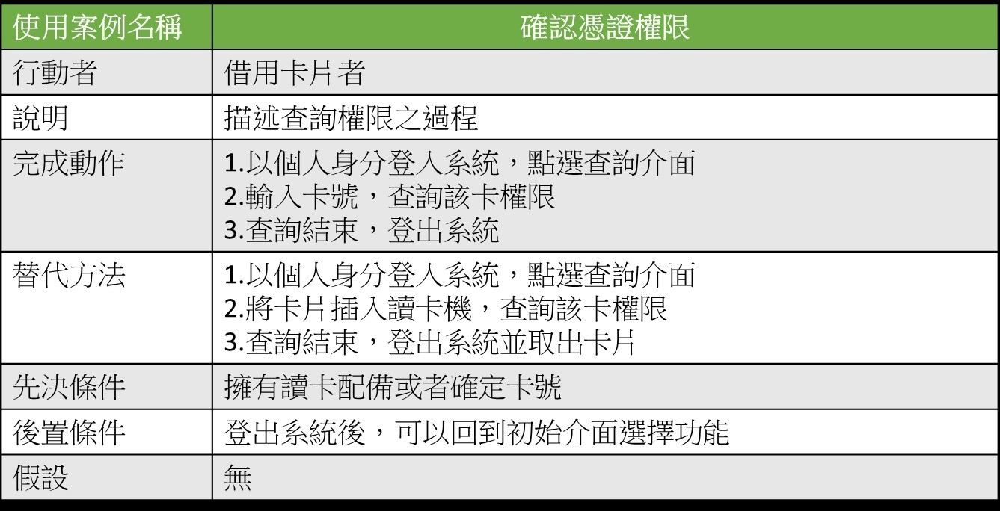
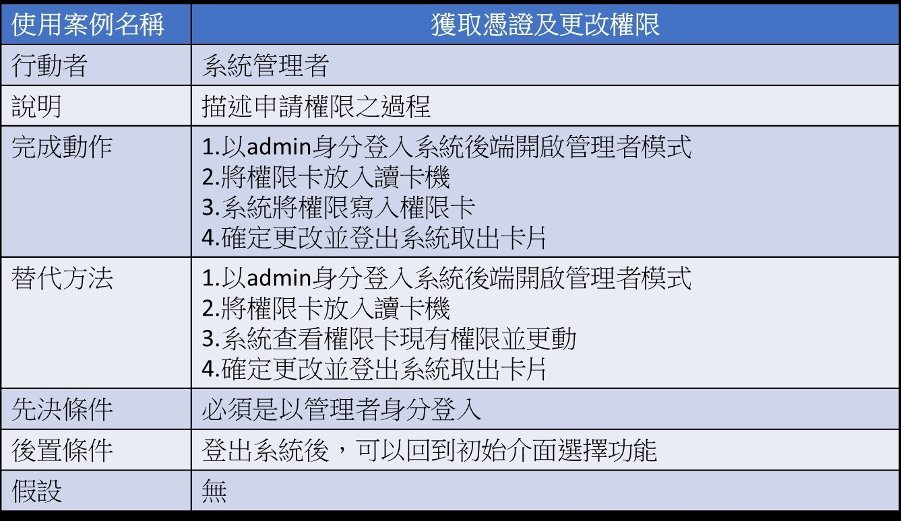
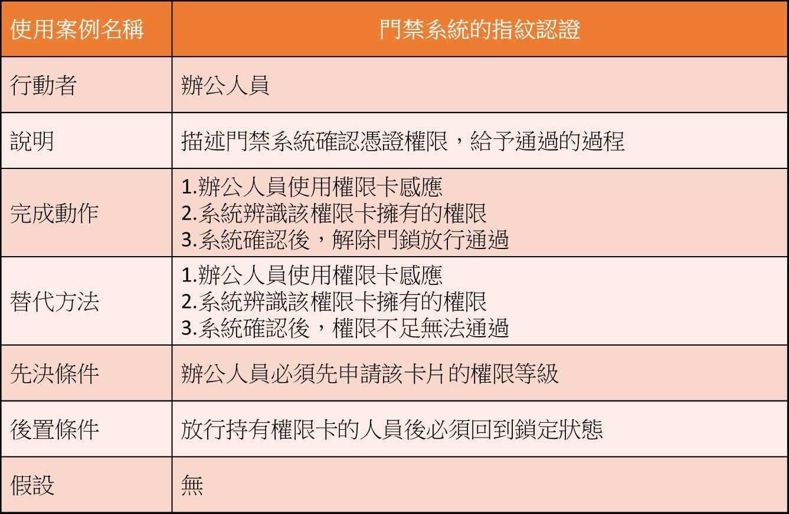
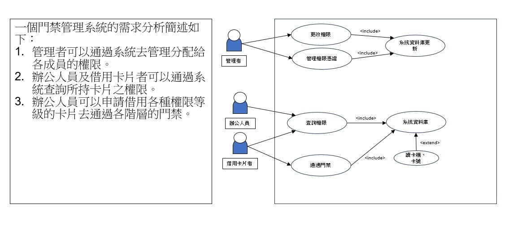

### 功能性需求
- 1.指紋辨識
- 2.控制門鎖ON/OFF
- 3.紀錄指紋
### 非功能性需求: 
- 1.系統能將指紋專換為16進制的編碼，用作金鑰用途
- 2.系統要能在5秒內回應使用者的指紋是否有登錄在資料庫
- 3.系統至少要能記錄50人的指紋
### 呈現功能分解圖(functional decomposition diagram, FDD)

### 使用案例圖（Use Case Diagram)

### 寫出如ppt p20 的需求分析的文字描述

